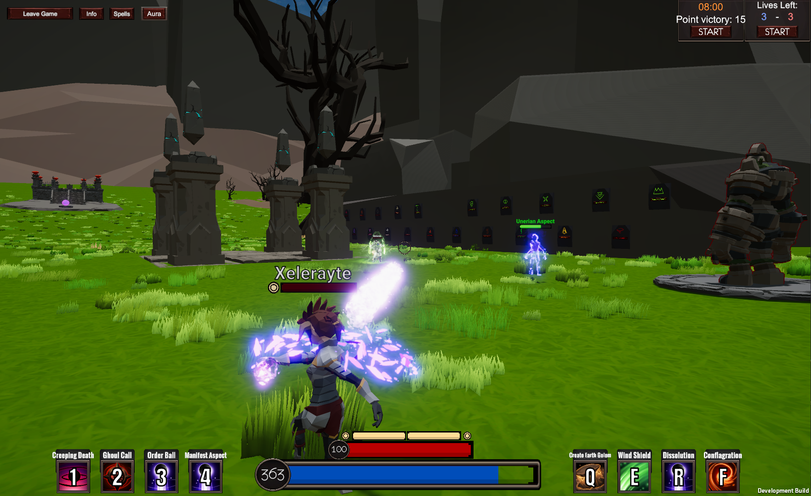

# AURICA 

#### Wield powerful and diverse magic in a strategic battle between mages. Every player is unique, with a pseudo-randomly generated Aura that interacts with every spell you cast and every hit you take. Aurica has a magic system with unparalleled depth and intricacy. The ceiling for growth in Aurica is limited only by your dedication.
----

### Description
Players face each other or against monsters in multiplayer battles of skilled spell casting. To excel, players must learn the strengths of their own pseudo-randomly generated Aura. A player's Aura is a distribution of mana that will interact with spell casting to make spells stronger or weaker depending on how the spell is composed. The magic system is incredibly deep but retains an ease-of-use that lets casual players have as much fun as the more dedicated players.

There are a wealth of spell options to choose from in each battle, with over 70+ unique spells from 10 different schools of magic, and more are being developed constantly.

### Novel features
The intent of the magic system is to create a novel system for spell-casting that has incredible depth but maintains a low barrier of entry for casual players. Some key features of the system include:
- **Unique player Auras:** every player has a completely unique Aura that influences how the magic system works for them.
- **Personality-based strengths:** take the quiz or randomly roll your Aura to shape the magic system to your preferences.
- **Classless spell-casting:** every player can cast any spell at any time.
- **Glyph drawing:** spell components can be drawn on the screen with glyphs to cast spells and rebind your loadout on the fly!
- **Spell crafting:** spells can be crafted using components to have enhanced effects at the cost of additional mana.
- **10 mana types:** many different mana types each with their own lore, unique spell-styles and type identities!
- **Cultivation:** participating in PvP matches or defeating tough enemies in adventure mode earns cultivation to develop your Aura.

### How to play
To get started, download the most recent pre-release build from the releases tab here in GitHub.

Once you have downloaded the game, you will be prompted to register an account. After you have created an account with a username and email you will be presented with the option to take the Aura questionnaire, which will influence how your Aura is rolled. You can also choose to skip this step and roll a completely random Aura.

Once you are logged in and have gone through the Aura generation, you will be moved onto the main menu. To get started, hit the "Free Play" button, which will put you in a  lobby where you can get a feel for the controls and choose a spell loadout to play with. There is a basic tutorial if you go through the gateway that is in front (and slightly to the right) of where you spawned in. After you are comfortable with the basics try out adventure mode, where you and your friends can battle monsters to earn cultivation points.

If you want to face a friend in a PvP match, return to the main menu and type in an agreed upon room name and hit the "Join Room" button. This will put you in the default battlegrounds. You can select the arena using the button beside the "Join Room" button. The default arena is a free for all mode with an objective ball in the middle (that you take and dunk at the spawnpoints), but there are also team deathmatch arenas available.

### [Read more about the game in a post on my website](https://elliothume.github.io/Aurica/)
----

#### Afterword:
This game is a passion project for developing the Aurica magic system. The game has progressed through multiple prototypes due to the creator's desire to play the game with others and share the game system in an way that players can get engaged in.

Due to the multi-stage prototyping process, and learning more as I go, the code is not well architectured. If the game shows promise when opened up to more players I will go through with an architectural refactoring of the prototype (or I might just start from scratch).

----

### [Learn how the magic system works on the Aurica System "Wiki"](https://bright-calculator-1a6.notion.site/The-Aurica-System-af806c3df2b7414681a50e7af7f74a52)

## Adventure Mode Screenshots ##

## PvP Arena Screenshots ##

